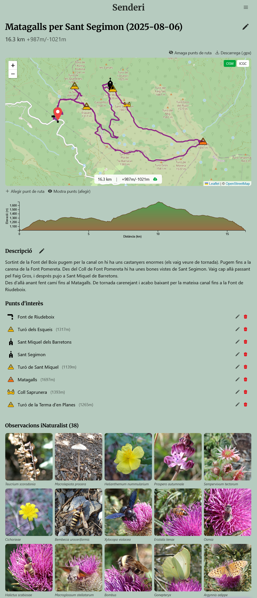

# Senderi 🥾

Senderi és un gestor d'excursions i cims.

Quan surto d'excursió guardo el track amb un rGPS, faig fotos d'animals i plantes, faig fotos dels llocs, i al final del dia... em pots passar el track? Em pots passar les fotos?

## Excursions

Per cada excursió hi ha un mapa amb el recorregut i fites d'interès. Hi ha també un enllaç per descarregar-se el track en format .gpx.

També hi pot haver una descripció de l'excursió.

Les observacions d'iNaturalist fetes.

Els geocatxes (Geocaching) trobats.

## Mapa

Al mapa hi ha llistat tots els punts d'interès. Per cada punt d'interès, es mostra una descripció i excursions associades a aquella fita, si en tinc alguna.

## Fita

Per cada fita hi ha un mapa de la seva ubicació així com una descripció, enllaços a les excursions que visiten el punt d'interès,  i enllaços a serveis externs (Wikidata, OpenStreetMap).

## Detalls tècnics

Front amb react construit amb Vite. Back amb Node escrit en Typescript. SQlite per a la base de dades.